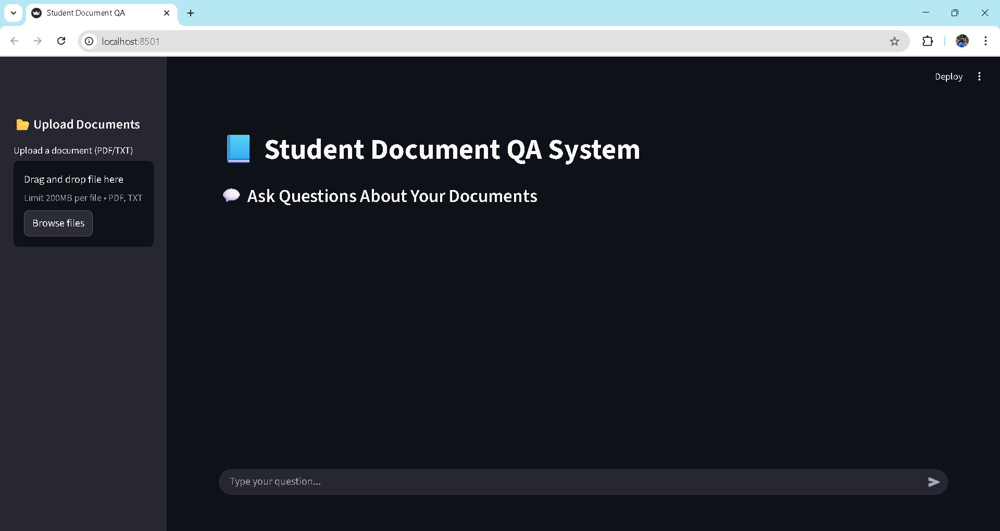
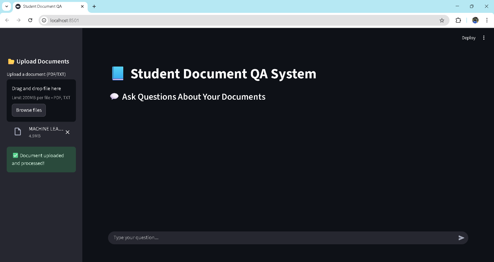
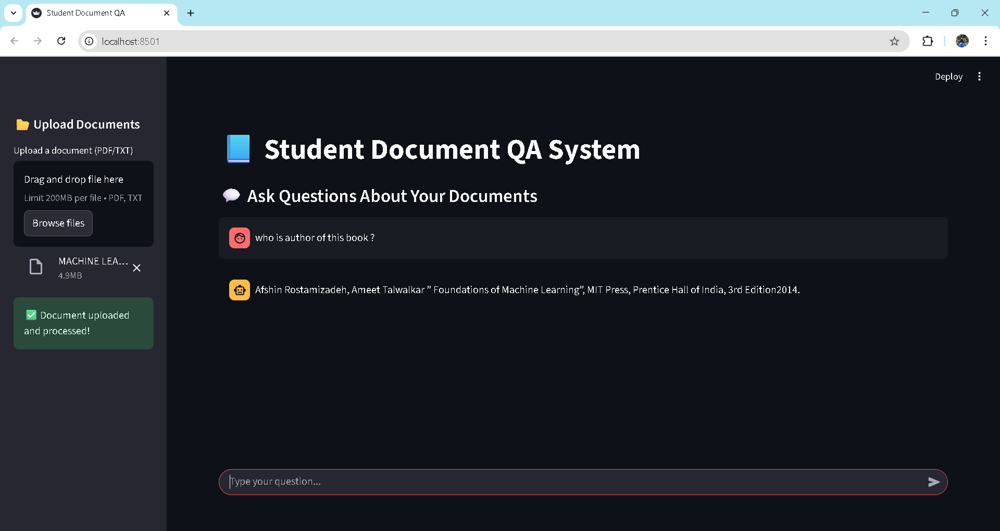
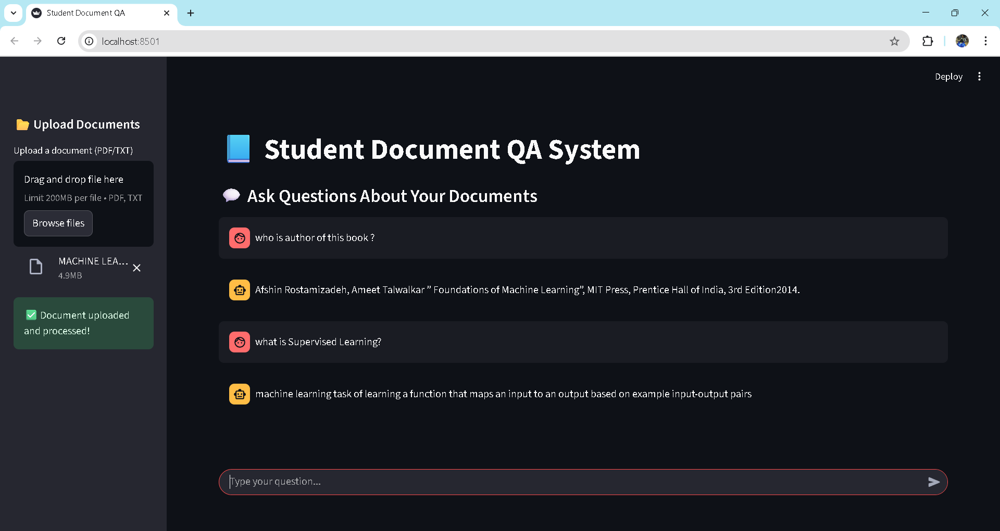

# 📘 Student Document Q&A System

A **Retrieval-Augmented Generation (RAG)** based application that allows students to upload and query documents in natural language. The system leverages embeddings, retrieval pipelines, and large language models to provide precise answers from academic resources.  

## 🚀 Features
- Upload and process student documents (PDF, text, etc.)
- Ask questions in natural language and get accurate responses
- Built with **Python, LangChain, Hugging Face models**
- Modular architecture with clear separation of backend (pipelines) and frontend (UI)
- Extensible design for adding custom models or datasets

## 📂 Project Structure
<pre>
student-doc-qa/
│── app/ # Core logic
│ ├── models/
│ │    └── embedding_model.py
│ ├── rag_pipeline.py
│ └── utils.py
│── ui/ # User interface
│ └──  app.py # streamlit
│── images/ # Place demo screenshots here
│ ├── demo.png
│ └── demo1.png
│── main.py # Entry point "FastAPI"
│── README.md
└── requirements.txt # Dependencies
</pre>


## 🛠️ Installation
1. Clone the repository:
   ```bash
   git clone https://github.com/your-username/student-doc-qa.git
   cd student-doc-qa/student-doc-qa

2. Create a virtual environment and activate it:

    python -m venv venv

    source venv/bin/activate   # Linux/Mac

    venv\Scripts\activate      # Windows

3. Install dependencies:

   pip install -r requirements.txt

## ▶️ Usage
Run the backend pipelines:
- python main.py

Start the UI:
- streamlit run ui/app.py

## 📸 Demo
Add your screenshots inside the images/ folder and reference them here:

Home Page


Document Upload


Q&A in Action


History


## 🏗️ Architecture
<pre>
flowchart TD
    A[User Uploads Document] --> B[Text Extraction]
    B --> C[Embeddings via Models]
    C --> D[Vector Store / Retrieval]
    D --> E[LLM for Answer Generation]
    E --> F[Streamlit UI Displays Answer]
</pre>

## 📋 Requirements

Python 3.9+

Streamlit

LangChain

Hugging Face Transformers

Other dependencies in requirements.txt

## 🤝 Contributing

Pull requests are welcome! For major changes, please open an issue first to discuss your ideas.

## 🔮 Future Improvements

✅ Add support for more file formats (Word, Excel)

✅ Enhance UI with file history and dark mode

✅ Deploy on Hugging Face Spaces or Streamlit Cloud for live demo
